# Introduction

The main goal of our application is to help users manage their finances. Our web application allows users to create an account, login, set a monthly budget and track individual expenses. By using our application users can categorise their transactions and generate a visual representation of their spending across each category. This functionality helps our users gain a deeper understanding of their finances. Additionally, our application allows multiple users to manage their finances together. Within our application users can create a group, invite multiple users to the group and subsequently manage group expenses. This feature will allow multiple users to access shared transaction data. The opportunity to manage both group expenses and individual expenses boosts the versatility of our application and will make our application more appealing to a wide range of users.

Following feedback on our design specification, we made changes to our System Architecture Diagram and ER diagram. Our updated System Architecture Diagram now highlights our application’s middleware.

During the development process, we gained a deeper understanding of the interactions between different entities, and we changed our ER diagram to reflect this. Our updated ER diagram now highlights the one-to-many relationship between the User entity and the Group entity. Our ER diagram reflects our implementation, that is that one user can join many groups and one user can create many groups. We also added new fields to the Transaction, Group, and User entities. The Transaction’s new fields were added to differentiate between individual transactions and group transactions. The Group’s new fields relate to group user management. Finally, the User’s new fields are largely related to user authentication and login functionality. Further details about the new fields can be seen in the updated field tables below.

The wireframes submitted in our design specification provided a blueprint for the initial user interface of our application and largely represent the final product. However, the team diverged from the wireframes for some pages and the wireframes have been updated accordingly to match the implemented appearance of our application. Furthermore, the initial design specification did not include a wireframe for the About page.

During development we decided that we wanted users to be notified when their total expenses exceeded their budget. Consequently, we added this as a new requirement, however the remaining list of requirements is unchanged from our initial design specification.

Finally, we made small changes to our site map to reflect the changes of our application’s appearance.

We deployed our web application using the PythonAnywhere service and our web application can be accessed via this public URL: [http://bakatat.pythonanywhere.com/\#/](http://bakatat.pythonanywhere.com/#/)

# Updated Design Specification

Overview of the implemented application

The implemented application is a responsive and visually appealing money management web application. This application will help users to manage their finance, where they can set a monthly budget, add expenses and track on their transactions. Our application comprises of user registration and login functionality​, setting a monthly budget​, tracking individual expenses​, transaction categorization and visualization, and group creation and management.

The frontend of our application was developed using the Vue front-end framework and the back end was developed using Django. The main functionality of our program was implemented in accordance with our design specification and our implemented application successfully meets our list of requirements. We developed multiple internal APIs to connect aspects of the front-end to the back-end.

List of requirements

1.  The user should be able to create an account using their email address and set a password.
2.  Users should be able to login and log out of their account.
3.  The user should be able to see their account information.
4.  The user should be able to add transactions for his/her own.
5.  The user should be able to choose a category for their transaction.
6.  The user should be able to set an overall budget.
7.  The user should be able to edit and delete transactions and view transaction details.
8.  The user should be able to see their total expenses and compare their total expenses with the set budget.
9.  The user should be able to create a group and take on the group admin role.
10. A group admin user should be able to invite other users to join a group.
11. The user should be able to be invited to join a group.
12. The user should be able to add and edit transactions in the group.

Additional requirements:

1.  The user should be notified if their total expenses are over their set budget.
2.  A group admin user should be able to delete members in the group.
3.  A group admin user should be able to delete the whole group.
4.  The user should be able to have a visualization of summary of the expenses.
5.  Visitor has a visitor mode, so the visitor could use the shared group id to see the shared list of group transactions

*Extra:* The system should be user-friendly; a beginner is able to use it proficiently quickly. The system should be fast, it should not take more than five seconds for the user to make a request and receive the result for performance and usability.

Updated System Architecture Diagram

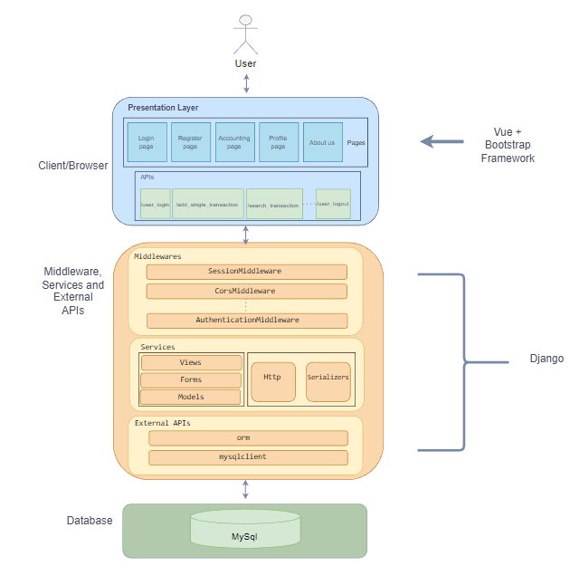

*Figure 1: system architecture diagram*

Our system architecture diagram mainly has three parts. The first one is client/ browser which we have the presentation layer that contains some pages such as login, page register page and so on. And then we have APIs that connect with the back end. For the front end which we use the Vue and bootstrap framework. We use APIs to connect with the service. Then for the middleware, services and external API part which it contains middleware like sessionMiddleware, corsMiddleware and so on. For services we have views forms models HTTP and serializers. for external APIs we just use orm and mysqlclient to manage and connect with the database. For the database we use mysql database.

Updated ER Diagram

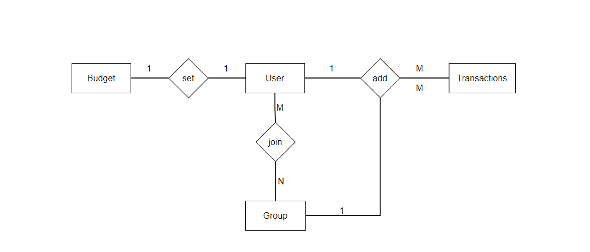

*Figure 2: ER Diagram*

Field Tables

|  USER         |                 |                                                           |
|---------------|-----------------|-----------------------------------------------------------|
| Field         | **Type**        | **Description**                                           |
| UserId        | AutoField       | (Primary Key) the unique user ID.                         |
| username      | CharField (30)  | The name set by user.                                     |
| groupId       | CharField (255) | The IDs of groups that the user belongs to.               |
| password      | CharField (200) | The user’s password, (required)                           |
| email         | CharField (32)  | The Email the user will create an account with.           |
| totalExpenses | IntegerField    | The sum of the user’s transactions for the budget period. |
| status        | IntegerField    | Represents user’s login status: 0 – offline, 1 - online   |
| role          | IntegerField    | Represents the user’s role: 0 – admin, 1 - user           |

|  TRANSACTION    |                |                                                                                                                                           |
|-----------------|----------------|-------------------------------------------------------------------------------------------------------------------------------------------|
| Field           | **Type**       | **Description**                                                                                                                           |
| transactionId   | AutoField      | (Primary Key) the unique transaction ID.                                                                                                  |
| ownerId\*       | CharField(255) | The user ID of the owner of the transaction. Foreign key referencing User.                                                                |
| category        | IntegerField   | The category which the transaction belongs to.（1.groceries, 2.charity, 3.eating out, 4.entertainment, 5.general, 6.transport, 7.other ） |
| values          | FloatField     | The amount of the transaction.                                                                                                            |
| createTime      | DateTimeField  | When the transaction was added to the application by the user.                                                                            |
| description     | CharField(32)  | The additional note for the transaction.                                                                                                  |
| transactionType | IntegerField   | 0 - personal transaction, 1 - group transaction                                                                                           |
| groupID         | IntegerField   | ID of the group                                                                                                                           |

| GROUP      |                |                                                                              |
|------------|----------------|------------------------------------------------------------------------------|
| Field      | **Type**       | **Description**                                                              |
| groupId    | AutoField      | (Primary Key) the unique group ID.                                           |
| name       | CharField(255) | The name of the group                                                        |
| adminId\*  | IntegerField   | The user ID of the administrator of the group. Foreign key referencing User. |
| bilIList   | CharField(255) | A list of the group’s transactions.                                          |
| numMembers | IntegerField   | The total number of members in the group.                                    |
| memberIds  | CharField(255) | The IDs the members that belong to the group                                 |
| email_list | CharField(255) | Group members’ email addresses                                               |

|  BUDGET    |               |                                                                       |
|------------|---------------|-----------------------------------------------------------------------|
| Field      | **Type**      | **Description**                                                       |
| budgetId   | AutoField     | (Primary Key) the unique budget ID.                                   |
| ownerId\*  | IntegerField  | The user ID of the owner of the budget. Foreign key referencing User. |
| setBudget  | IntegerField  | The total amount the user sets for their monthly budget.              |
| modifyTime | DateTimeField | The last modified time of the budget information.                     |
| startDate  | DateField     | The date when the budget starts to take effect.                       |

Updated Site Map

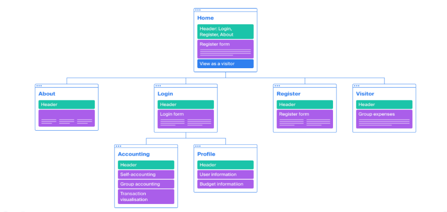

*Figure 3: Site Map*

Wireframes

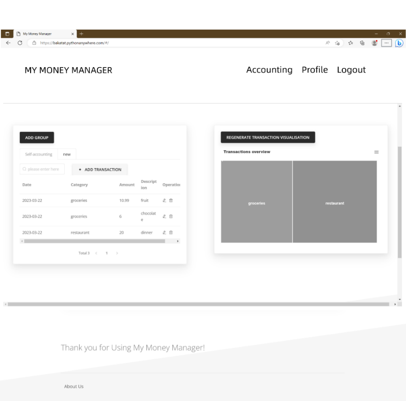

*Figure 4: self-accounting Wireframes*

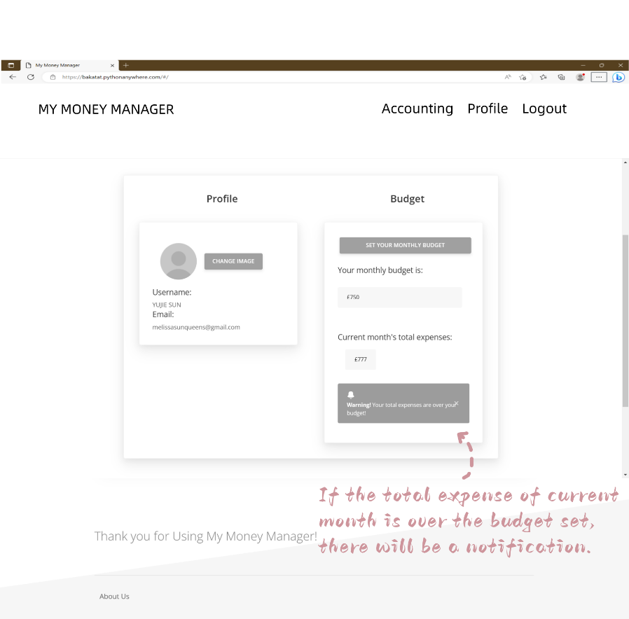

*Figure 5: Profile Wireframes*

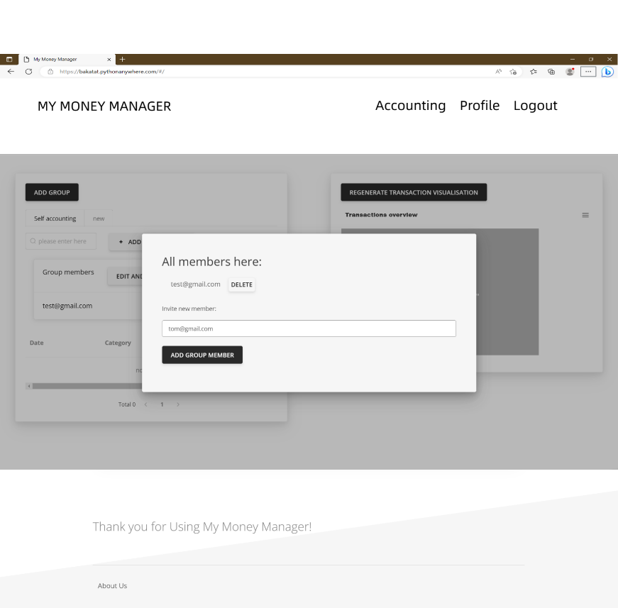

*Figure 6: edit group member Wireframes*

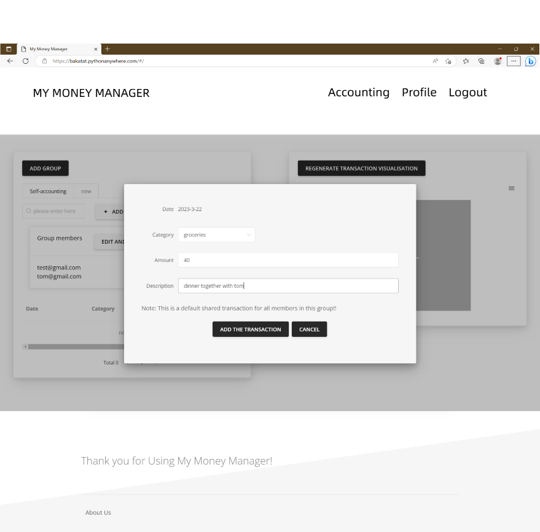

*Figure 7: add transactions Wireframes.*

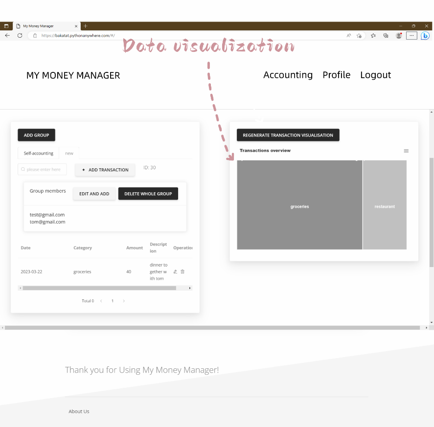

*Figure 8: Group information Wireframes*

# Implementation

3.1 General Description

The implementation of the project is divided into the front-end and back-end. Our application was developed using a range of technologies, including the Vue front-end framework, Django, HTML, CSS, JavaScript, and AJAX. The design, look and feel of our application was achieved using the Vue front-end framework. We chose the Vue framework due to its versatility and its ability to easily integrate HTML, CSS and JavaScript using Vue’s single-file component system. We did not use the Django template directory, as the Vue framework provides its own structure for Templates. Instead, the application’s front-end code is contained within the ‘frontend’ folder.

All parts of the remaining code implementation use Django, however, for the view functions, it returns response data without a render, as the response is handled by the front-end. For GET methods which are getting data, it should return a response in JSON format with the required data attributes; for POST methods which are modifying data, it should return a response message of success or error according to the result.

3.2 Components

There are five main components of our web application: the User component (Register/Log in/Log out), the Accounting (Transaction) component, the Profile component which provides user information and is where users can set their budget, About component that has a short introduction of our web application, and Visitor component that visitor could experience our web application shortly.

3.2.1 User

The user management module includes 4 interfaces: **user login, user logout, user register**.

This module allows the addition, display, and login status modification of User entities.

The User class inherits from Django's *AbstractUser* class, which uses Django's built-in authenticate, login, and logout functions to authenticate login and logout, allowing Django to automatically manage sessions. The user ‘email’ field was set as unique to allow it to be used as the authentication field, along with the user’s chosen password. The password is encrypted and saved to the database by using the *AbstractUser.create_user* method.

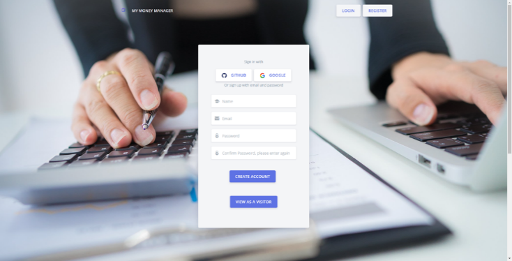

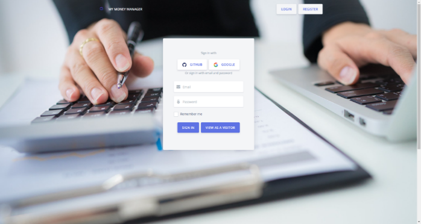

*Figure 9: The login page*    *Figure 10: The register page*

3.2.2 Profile

The Profile page is divided into two sections: personal information and budget management. The profile section displays the user’s username and email address, and this was achieved §by using the budget component is where users can set their monthly budget. Users can set their budget by selecting the “set monthly budget” button and their inputted budget will be displayed on the page. Another key section is the ‘current monthly expenses’ this area of the profile page displays the user’s total transactions, and we implemented a Modal to display an alert if the user’s total expenses are over their budget. These features meet the key user and budget requirements outlined in our design specification and will help the user compare their expenses in relation to their set budget.

The budget management model includes 2 interfaces: **Set budget, get the summary** of total expenses. The set budget function just pass the user’s pre-set expected budget to the Budget view, while the getting summary calculates the summary of user’s expense classified in categories, and the total expense will be shown in the Budget view.

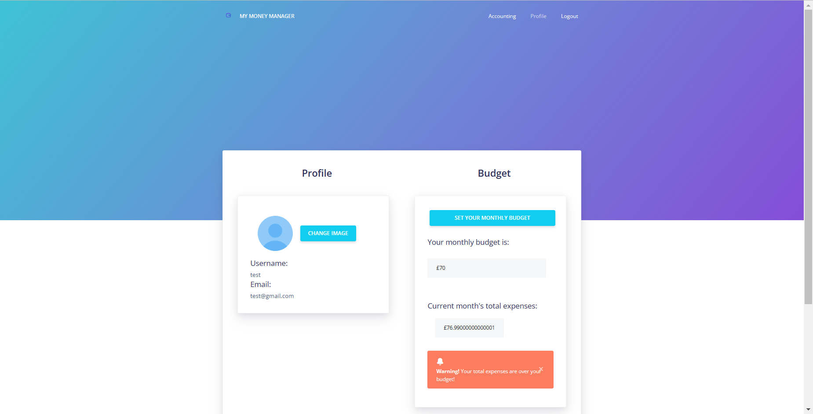

*Figure 11: User Profile Pag*e

3.2.3 Accounting (Group management and transactions management)

In overview, this is the core part of the application function, for which a user could gain access to and manage a transaction list for self or a transaction list for a group which the user belonged to. In a group transaction list, the user could achieve management of a group.

The transaction management model includes 8 interfaces:

**get transaction list** (for self / for group), **add a transaction** (for self / for group), **edit a transaction, delete a transaction, search a transaction** (for self / for group).

These are Create, Read, Update, and Delete (CRUD) operations to the database. In the Django backend part, the *model.objects* Attribute is mainly used for filtering/ getting data from the database, alternating data and deleting a row. The noticeable component is that Paginator module is imported to achieve paging for showing all kinds of transaction list. When dealing with a new adding transaction, a form of transaction is used to validate the input fields.

The group management model includes 5 interfaces:

**Create a group, add members, delete a group, remove members, get member names** by group id. Basically, these are CRUD operations to the database. The group model is associated with many other models, requiring a more detailed business logic implementation.

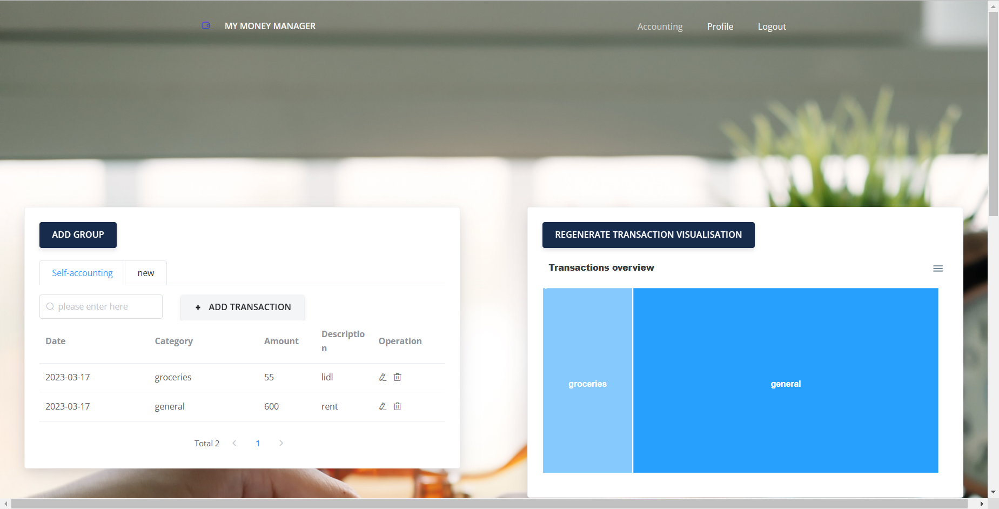 *Figure 12: Group Transaction Page*  *Figure 13: Self Transaction Page 1*

3.2.4 About

The about us page is showing a short information about this web application that could briefly introduce to others.

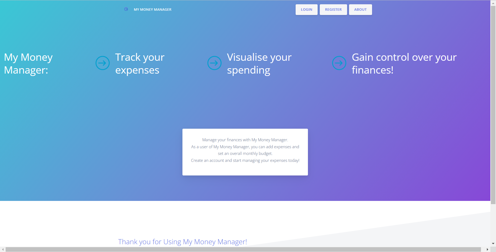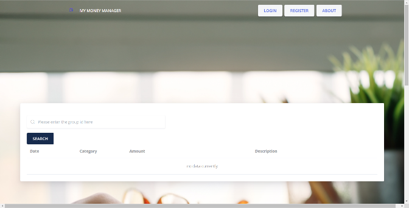

*Figure 14: About Page    Figure 15: Visitor Page*

3.2.5 Visitor

The visitor could use the shared group id from his/her friend to look at their shared group transaction list without login and register. Figure 15 is the screen shot of visitor mode.

# Future Release

-   Allow users to create their own categories and assign these to transactions​
    -   Editing the group name after creation​
    -   Logging in via Google​ Facebook GitHub
    -   Notifying users when they have been added to a group
    -   Choose members who share the bill
    -   Upload IMG of profile
    -   Could send invite email to new shared transaction members
    -   New user could use invited email to come to our website and register
    -   Search function for visitor
    -   Visualization split for group and self
